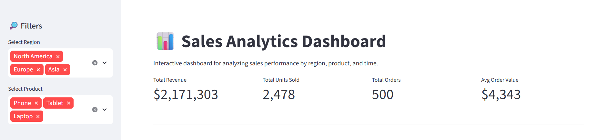
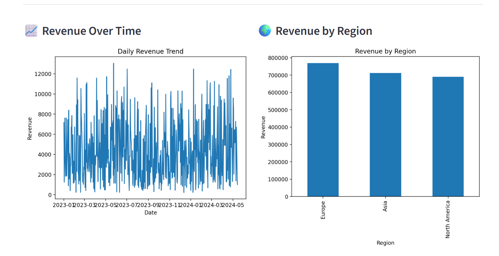
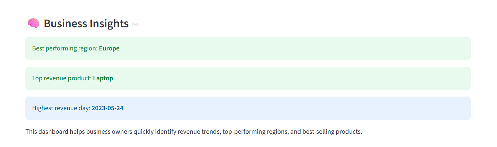

# 📊 Sales Analytics Dashboard

An interactive data dashboard built using Python and Streamlit to analyze sales performance across regions, products, and time.

---

## 🚀 Features
- 📈 Revenue trends over time
- 🌍 Region-based performance analysis
- 💻 Product-level insights
- 🔎 Interactive filters (region & product)
- 🧠 Automatic business insights (top region, product, best day)

---

## 🛠️ Tech Stack
- Python
- Pandas
- Matplotlib
- Streamlit

---

## 📸 Dashboard Preview


## 📸 Dashboard Preview





---

## ▶️ How to Run

```bash
pip install -r requirements.txt
streamlit run app.py
